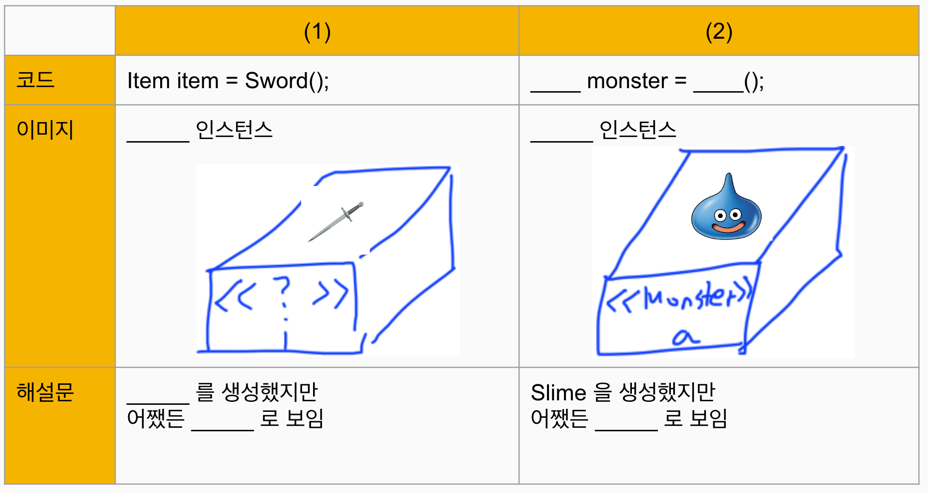
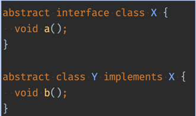
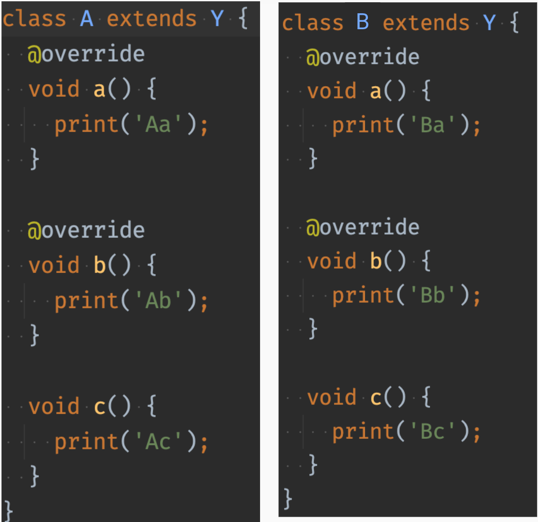

> 연습문제 1

(1) 답 
이미지 : Sword 인스턴스
해설문 : Sword를 생성했지만 어쨌든 Item 으로 보임

(2) 답
코드 : Monster monster = Slime();
이미지 : Slime 인스턴스
해설문 : Slime을 생성했지만 어쨌든 Monster 로 보임

=> 컴파일러는 타입 선언한 부분 만을 확실하다 여기기 때문에,  
선언한 인스턴스는 자식 클래스 중 어느 것 일 지라도 선언한 타입이라고 여기고 해석하여 작동하게 된다.
그래서 Sword 인스턴스를 생성했어도 Item 클래스를 바라보고,
Slime 인스턴스를 생성했어도 Monster로 선언했기 때문에 Monster 클래스를 바라본다.

----

> 연습문제 2
이런 클래스가 선언되어 있다. 다음 물음에 답하시오.

(polymorphism.dart 파일에 클래스 구현해 놓음)

1. X obj = A(); 로 A 인스턴스를 생성한 후, 변수 obj에서 호출할 수 있는 메소드를 a(), b(), c() 중에 골라보시오.
답 : a();
=> 왜냐하면, A클래스를 인스턴스 생성했지만 선언한 것은 결국 X 클래스 이므로 X 클래스에 해당하는 a(); 메소드만 호출 가능하다.

2. Y y1 = A(); 
Y y2 = B(); 로 A와 B의 인스턴스를 생성한 후 
y1.a();
y2.a(); 를 실행했을 때에 화면에 표시되는 내용을 말하시오.

답 : Aa, Ba
=> Y 클래스를 선언하여 인스턴스를 생성했기 때문에, 호출한 a() 메소드는 A 클래스와 B 클래스 내부 각각에서 오버라이드한 a()메소드가 실행된다.